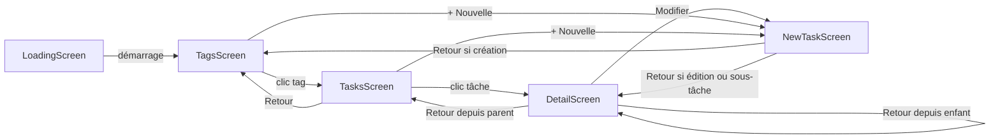
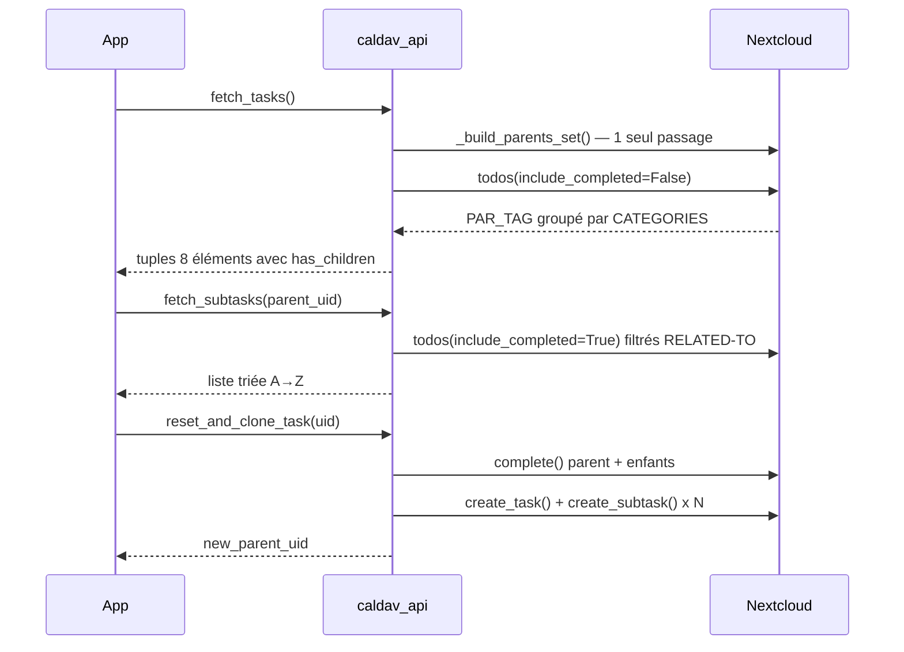

# gtgDroid — Journal de développement

## Vision

Application Android de gestion de tâches GTD, clone mobile de GTG (Getting Things GNOME), synchronisée via CalDAV avec Nextcloud. Objectif final : publier sur F-Droid.

---

## Architecture du projet

```
gtgDroid/
├── main.py                  # App Kivy + ScreenManager
├── caldav_api.py            # Toute la logique CalDAV (fetch, create, update, delete)
├── state.py                 # Variables globales partagées entre écrans
├── widgets.py               # Composants réutilisables (confirm_popup, loading_popup)
├── config.py                # URL, USERNAME, PASSWORD Nextcloud (non versionné)
├── screens/
│   ├── __init__.py
│   ├── loading.py           # Écran de chargement au démarrage
│   ├── tags.py              # Liste des tags avec compteur + boutons de vue
│   ├── tasks.py             # Liste des tâches d'un tag
│   ├── detail.py            # Détail d'une tâche
│   └── new_task.py          # Formulaire création/modification/sous-tâche
├── NotoColorEmoji.ttf
├── NotoEmoji.ttf
├── Suivi/
│   ├── gtgDroid.md          # Ce fichier
│   └── GTGDroid_vision.md
└── .venv/                   # Python 3.13, Kivy 2.3.1, caldav 2.2.6
```

### Lancer l'application

```bash
cd /home/pentux/Documents/IT/gtgDroid
source .venv/bin/activate
python3 main.py
```

---

## Modèle de données

### Tuple tâche (8 éléments)

```python
(title, status, due_str, start_str, description, task_uid, priority, has_children)
#  [0]    [1]     [2]      [3]         [4]          [5]       [6]       [7]
```

| Index | Champ | Type | Exemple |
|-------|-------|------|---------|
| 0 | title | str | `"Préparer le marché"` |
| 1 | status | str | `"NEEDS-ACTION"`, `"COMPLETED"` |
| 2 | due_str | str | `"31/12/2025"` ou `""` |
| 3 | start_str | str | `"01/12/2025"` ou `""` |
| 4 | description | str | Notes libres |
| 5 | task_uid | str | UUID CalDAV |
| 6 | priority | int | `0`, `5`, `9` |
| 7 | has_children | bool | `True` si la tâche a des sous-tâches |

> ⚠️ Le tuple est passé à 8 éléments en février 2026. Tout code qui dépacke le tuple doit inclure `has_children`.

### Variables globales (`state.py`)

```python
PAR_TAG = {}          # dict {tag: [tuple_tâche, ...]} — tâches ouvertes
PAR_TAG_CLOSED = {}   # dict {tag: [tuple_tâche, ...]} — tâches fermées
CURRENT_TAG = ''      # tag sélectionné en cours
CURRENT_VIEW = 'open' # vue active : 'open', 'actionable', 'closed'
```

---

## Navigation entre écrans



### Transitions
- Direction `left` : avancer
- Direction `right` : reculer
- Type : `SlideTransition` (Kivy)
- Navigation sous-tâche : `load_task(sub_data, from_parent_data=task_data)` — retour automatique au parent, à n'importe quelle profondeur

---

## Architecture des vues

| Vue | Source | Filtre |
|-----|--------|--------|
| Ouvertes | `PAR_TAG` | aucun |
| Actionnables | `PAR_TAG` | `is_actionable()` : exclut PRIORITY=9 et DTSTART futur |
| Fermées | `PAR_TAG_CLOSED` | STATUS == COMPLETED |

---

## Flux CalDAV



### Fonctions `caldav_api.py`

| Fonction | Description |
|----------|-------------|
| `get_client()` | Nouvelle instance DAVClient (pas de cache) |
| `_build_parents_set(principal)` | Set des UID parents — un seul passage réseau |
| `_clean_tags(tags)` | Retire `@`, filtre `DAV_gtg`, retourne `['Sans tag']` si vide |
| `_parse_tags(tag_str)` | Découpe `"IT, urgent, @perso"` → `['IT', 'urgent', 'perso']` |
| `fetch_tasks()` | Tâches ouvertes groupées par tag, avec `has_children` |
| `fetch_tasks_completed()` | Tâches COMPLETED groupées par tag |
| `fetch_subtasks(parent_uid)` | Sous-tâches d'une tâche, triées A→Z |
| `fetch_tags_for_uid(uid)` | Tous les tags d'une tâche → string `"IT, urgent"` |
| `create_task(title, tags, ...)` | Crée dans le calendrier `gtg` — multi-tags supporté |
| `create_subtask(parent_uid, title, tags, ...)` | Crée avec RELATED-TO |
| `update_task(uid, title, tags, ...)` | Modifie — multi-tags supporté |
| `delete_task(uid)` | Supprime définitivement |
| `mark_as_done(uid)` | `todo.complete()` — ne supprime pas |
| `reset_and_clone_task(uid)` | Archive + recrée la tâche et ses enfants à zéro |

---

## Sous-tâches

### Fonctionnement technique
Champ CalDAV standard `RELATED-TO` :
```
RELATED-TO;RELTYPE=PARENT:[uid_parent]
```
Compatible GTG desktop, tasks.org, Nextcloud.

### Tri
Alphabétique sur le titre. Convention recommandée : préfixer `01-`, `02-` ou `A-`, `B-` pour contrôler l'ordre.

### Indice visuel
- Liste des tâches : icône `▶` et fond bleuté pour les tâches parentes
- Détail : titre préfixé `▶` en bleu
- Liste des tags : indicateur `▶` si le tag contient des tâches parentes

### Navigation dans le détail
- Cases `○` / `✓` cochables directement
- Bouton `>` pour naviguer dans le détail de chaque enfant
- Retour depuis l'enfant → revient sur le parent (pas sur la liste)
- Bouton `+ Ajouter une sous-tâche` toujours visible (même sans enfants existants)

---

## Réinitialiser une tâche récurrente (non cyclique)

> **Vocabulaire** : "récurrent" = qui revient. "Cyclique" = qui suit un cycle régulier.
> Les marchés, renouvellements médicaments etc. sont **récurrents mais non cycliques** — pas adaptés à RRULE.

### Le bouton `↺ Réinitialiser → "Un jour"`

1. Archive la tâche actuelle et toutes ses sous-tâches (COMPLETED)
2. Crée une copie fraîche : même titre, mêmes sous-tâches, PRIORITY=9, sans dates

```
Avant :                         Après :
✅ Préparer le marché           o  Préparer le marché  (Un jour)
   ✅ 01-Tréteaux                  o  01-Tréteaux
   ✅ 02-Nappes                    o  02-Nappes
```

### Différence avec "Marquer comme faite"

| Action | Effet | Sous-tâches |
|--------|-------|-------------|
| ✓ Marquer comme faite | Archive uniquement | Non touchées |
| ↺ Réinitialiser | Archive + recrée | Archivées ET recréées à zéro |

---

## Gestion des tags

### Convention GTG
GTG stocke les tags avec `@` en CalDAV : `@IT`, `@urgent`. gtgDroid retire le `@` à la lecture — l'utilisateur ne le saisit jamais.

### Tag technique `@DAV_gtg`
Ajouté automatiquement par GTG à toutes ses tâches CalDAV. Filtré à la lecture, jamais affiché.

### Multi-tags
Saisie : `IT, urgent, perso` (virgule comme séparateur).
Si l'utilisateur tape `@IT`, le `@` est retiré silencieusement.
En édition, le champ est pré-rempli avec tous les tags récupérés depuis CalDAV via `fetch_tags_for_uid()`.

---

## Gestion des dates fuzzy

### Problème
GTG desktop stocke les dates fuzzy en XML local (`<due>soon</due>`, `<due>someday</due>`). Ces valeurs **ne sont pas synchronisées vers CalDAV**. Limitation connue de GTG.

### Solution adoptée : champ PRIORITY CalDAV

| Bouton gtgDroid | PRIORITY CalDAV | Affiché dans GTG desktop |
|-----------------|-----------------|--------------------------|
| Maintenant | 0 (aucune) | Pas de date |
| Bientôt | 5 | Pas de date (ignoré) |
| Un jour | 9 | Pas de date (ignoré) |

**Avantages :** standard CalDAV, supporté par tasks.org, transparent pour GTG.
**Limitation :** pas de bidirectionnalité GTG → gtgDroid pour les dates fuzzy.

### Pistes futures
- **"Verrue" Debian** : script surveillant CalDAV, réécrit le XML GTG local avec `soon`/`someday` quand PRIORITY=5/9
- **Patch GTG upstream** : contribution au projet getting-things-gnome/gtg

---

## Performance

### État actuel (140 tâches)
- Chargement initial : ~8 secondes
- Chargement des sous-tâches dans le détail : ~15 secondes

### Cause et solution future
`fetch_subtasks()` refait un `_build_parents_set()` complet à chaque appel. Piste : construire un dict `{uid: [sous-tâches]}` en un seul fetch au démarrage, stocké dans `state.py`.

---

## Roadmap

### Phase 1 — Fonctionnalités core
- [x] Connexion CalDAV Nextcloud
- [x] Lecture tâches par tags (CATEGORIES)
- [x] Créer, modifier, supprimer une tâche
- [x] Marquer comme faite avec `todo.complete()`
- [x] Countdown 3 secondes avec annulation
- [x] Écran de chargement
- [x] DTSTART et DUE en lecture et édition
- [x] Dates fuzzy Bientôt/Un jour via PRIORITY CalDAV
- [x] Vue Ouvertes / Actionnables / Fermées
- [x] Sous-tâches (RELATED-TO) — lecture, création, cochage
- [x] Navigation parent ↔ enfant avec retour correct
- [x] Indice visuel ▶ sur les tâches parentes
- [x] Réinitialiser une tâche récurrente (archive + clone)
- [x] Multi-tags — saisie `tag1, tag2`, nettoyage `@`
- [x] Bouton + dans la liste des tâches d'un tag
- [ ] Affichage des tags dans le détail d'une tâche
- [ ] Statuts complets (Actif, Différé, À faire, Inactif)

### Phase 2 — Fonctionnalités avancées
- [ ] Optimisation performance (cache sous-tâches dans state)
- [ ] Compteur X/X tâches réalisées par tag
- [ ] Poids en temps (durée estimée)
- [ ] Rappels
- [ ] Tags hiérarchiques

### Phase 3 — Design
- [ ] Interface proche de GTG desktop
- [ ] Tags affichés en surbrillance sous le titre (comme GTG)
- [ ] Afficher "Bientôt" au lieu de la date quand échéance < 15 jours
- [ ] Indicateur visuel Maintenant/Bientôt/Un jour dans la liste
- [ ] Icônes, couleurs, polices

### Phase 4 — Android
- [ ] Packaging APK avec Buildozer
- [ ] Tests sur Fairphone
- [ ] Publication F-Droid

### Phase 5 — Contribution open source
- [ ] "Verrue" Debian pour synchronisation des dates fuzzy
- [ ] Patch GTG pour bidirectionnalité des dates fuzzy via CalDAV
- [ ] Soumettre Pull Request au projet getting-things-gnome/gtg

---

## Notes techniques

| Problème | Solution |
|----------|----------|
| `uid` réservé par Kivy | Utiliser `task_uid` |
| `background_color` non supporté sur Label | Utiliser `canvas.before` |
| Warning `Ical data was modified` | Inoffensif — Nextcloud ajoute DTSTAMP manquant |
| `date` réservé Python | Utiliser `date_str` |
| `_has_children()` par tâche = N appels réseau | Remplacé par `_build_parents_set()` — 1 seul passage |
| State résiduel dans NewTaskScreen | `edit_uid` et `parent_uid` remis à `None` en premier dans `load_form()` |
| Tags GTG avec `@` | `_clean_tags()` à la lecture, `_parse_tags()` à l'écriture |
| `@DAV_gtg` tag technique | Filtré dans `_TAGS_IGNORES` |
| Multi-tags en édition | `fetch_tags_for_uid()` récupère tous les tags depuis CalDAV |
| Indentation Python | 4 espaces par niveau, jamais de tabulations |

---

## Environnement

| Élément | Version |
|---------|---------|
| Python | 3.13 |
| Kivy | 2.3.1 |
| caldav | 2.2.6 |
| Serveur CalDAV | Nextcloud (globenet.org) |
| OS dev | Debian |
| Cible | Android (Fairphone) |
| Distribution | F-Droid (objectif) |

---

## Dépôt Git

```
https://github.com/pentux-GitHub/gtgDroid
```

### `.gitignore` recommandé

```
.venv/
__pycache__/
*.pyc
config.py
```

> ⚠️ `config.py` contient les credentials Nextcloud — ne jamais le committer.
